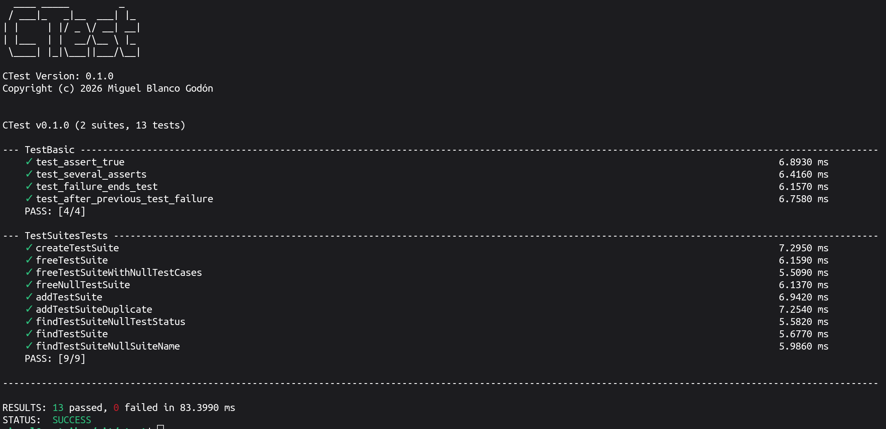

# CTest

A lightweight, zero-boilerplate C unit testing library.

## Features

* **Auto-Registration:** Write tests without manually adding them to a `main()` function or maintaining test suites.
* **Minimal Boilerplate:** Define tests using intuitive macros and let CTest handle execution and setup.
* **Test functions:** Support for general test assertions and equality functions.

## Installation

Clone the repository and install CTest globally using `make`:

```bash
git clone https://github.com/meluchoMZ/ctest.git
cd ctest
make
sudo make install
```

## Quick start guide

Include `<ctest_api.h>` in your test source files, write your test cases, and compile. No explicit `main()` wrapper or test setup code is required.

```C
#include <ctest_api.h>

TEST(MathSuite, AdditionTest, "Verifies basic addition operations") {
    int result = 2 + 2;
    assertTrue(result == 4);
}

TEST(MathSuite, SubtractionTest, "Verifies basic subtraction operations") {
    int result = 5 - 3;
    assertFalse(result == 0);
}
```

Then, compile your test with 

```bash
gcc -o test_example test_example.c -lctest
./test_example
```

## Documentation

Coming soon

## Screenshots


